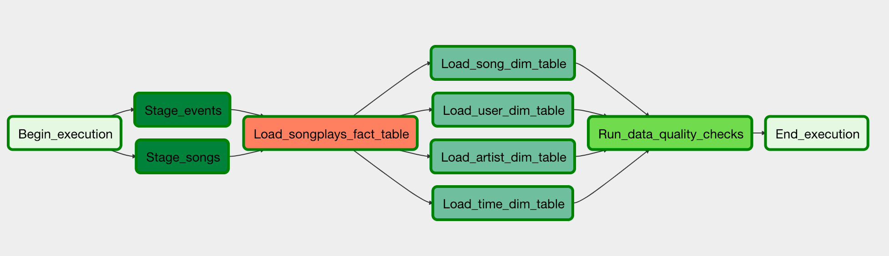

# Project Data Pipelines with Apache Airflow

## Table of Contents

  * [Introduction](#introduction)
  * [Installation](#installation)
  * [Data Source](#data-source)
  * [Task Definitions](#task-definitions)
  * [References](#references)
  * [License](#license)


## Introduction
This is a project for the course Data Pipelines with Apache Airflow of the Udacity Data Engineer Nanodegree.

 "" A music streaming company, Sparkify, has decided that it is time to introduce more automation and monitoring to their data warehouse ETL pipelines and come to the conclusion that the best tool to achieve this is Apache Airflow.

They have decided to create high grade data pipelines that are dynamic and built from reusable tasks, can be monitored, and allow easy backfills. They have also noted that the data quality plays a big part when analyses are executed on top the data warehouse and want to run tests against their datasets after the ETL steps have been executed to catch any discrepancies in the datasets.

The source data resides in S3 and needs to be processed in Sparkify's data warehouse in Amazon Redshift. The source datasets consist of JSON logs that tell about user activity in the application and JSON metadata about the songs the users listen to ""

The project requires to create custom operators to perform tasks such as staging the data, filling the data warehouse, and running checks on the data as the final step.
The final DAG of the data pipeline looks like this:


## Installation
To run this project, airflow needs to be installed. Once it is installed, you have to move the dag and the custom operators to the airflow/dags folder.
The project can be executed directly using the Apache Airflow web interface.

## Data Source

For this project, the source data is stored in S3 and is in JSON format. The data is stored in the following buckets:
* **Log data**: stored at `s3://udacity-dend/log_data`
* **Song data**: stored at `s3://udacity-dend/song_data`

## Tasks Definitions

### Staging
The stage task is able to load any JSON formatted files from S3 to Amazon Redshift. The operator creates and runs a SQL COPY statement based on the parameters provided. The operator's parameters specify where in S3 the file is loaded and what is the target table.
#### Staging events
The staging events task loads the JSON files from S3 to the staging_events table.

```
staging_events:
  type: CustomOperator
  task_id: stage_events
  redshift_conn_id: redshift
  aws_credentials_id: aws_credentials
  table: staging_events
  s3_bucket: s3://udacity-dend/log_data
  s3_key: log_json_path.json
  json_path: $
```
The `json_path` parameter is used to specify the path to the JSON file in the S3 bucket.
#### Staging songs
The staging songs task loads the JSON files from S3 to the staging_songs table.

```
staging_songs:
  type: CustomOperator
  task_id: stage_songs
  redshift_conn_id: redshift
  aws_credentials_id: aws_credentials
  table: staging_songs
  s3_bucket: s3://udacity-dend/song_data
  s3_key: song_json_path.json
  json_path: $
```

### Load fact table
The load fact table task loads the data from the staging tables to the fact table.

```
load_songplays_table:
  type: CustomOperator
  task_id: load_songplays_table
  redshift_conn_id: redshift
  aws_credentials_id: aws_credentials
  sql:
    - "INSERT INTO songplays (start_time, user_id, level, song_id, artist_id, session_id, location, user_agent)
        SELECT DISTINCT TIMESTAMP 'epoch' + se.ts/1000 * INTERVAL '1 second' AS start_time,
               se.userId AS user_id,
               se.level AS level,
               ss.song_id AS song_id,
               ss.artist_id AS artist_id,
               se.sessionId AS session_id,
               se.location AS location,
               se.userAgent AS user_agent
        FROM staging_events se
        JOIN staging_songs ss
        ON (se.song = ss.title AND se.artist = ss.artist_name AND se.length = ss.duration)
        WHERE se.page = 'NextSong'"
```

### Load dimension tables
The load dimension tables task loads the data from the staging tables to the dimension tables.
#### Load users table 
The load users table task loads the data from the staging tables to the users table.

```
load_users_table:
  type: CustomOperator
  task_id: load_users_table
  redshift_conn_id: redshift
  aws_credentials_id: aws_credentials
  sql:
    - " SELECT distinct userid, firstname, lastname, gender, level
        FROM staging_events
        WHERE page='NextSong' "
```
#### Load songs table

The load songs table task loads the songs data from the stating tables to the song dimensional table.

```
load_songs_table:
  type: CustomOperator
  task_id: load_songs_table
  redshift_conn_id: redshift
  aws_credentials_id: aws_credentials
  sql:
    - " SELECT distinct song_id, title, artist_id, year, duration
        FROM staging_songs"
```

#### Load artists table
The load artists table task loads the artists data from the stating tables to the artist dimensional table.

```
load_artists_table:
  type: CustomOperator
  task_id: load_artists_table
  redshift_conn_id: redshift
  aws_credentials_id: aws_credentials
  sql:
    - " SELECT distinct artist_id, artist_name, artist_location, artist_latitude, artist_longitude
        FROM staging_songs"
```

#### Load time table
The load time table task loads the time data from the stating tables to the time dimensional table.

```
load_time_table:
  type: CustomOperator
  task_id: load_time_table
  redshift_conn_id: redshift
  aws_credentials_id: aws_credentials
  sql:
    - " SELECT start_time, extract(hour from start_time), extract(day from start_time), extract(week from start_time), extract(month from start_time), extract(year from start_time), extract(dayofweek from start_time)
        FROM songplays"
```
### Run quality checks
The quality checks task runs the quality checks on the fact and dimension tables.
It verifies that the data is loaded and that the specified table columns contain no null values.

```
run_quality_checks:
  type: DataQualityOperator
  task_id: data_quality_checks
  redshift_conn_id: redshift
  aws_credentials_id: aws_credentials
  tables:
    - songplays
    - users
    - artists
    - songs
    - time
```

## References
- [Redshift Documentation](https://docs.aws.amazon.com/redshift/latest/dg/t_CREATE_TABLE.html)
- [Apache Airflow Documentation](https://airflow.apache.org/docs/stable/macros-ref.html)
- [Apache Airflow DAGs](https://airflow.apache.org/docs/stable/macros-ref.html#macros-ref-dags)

## License
This project is licensed under the MIT license.


